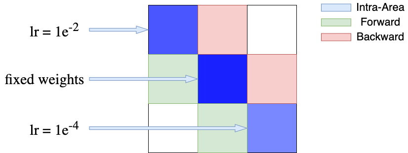

# NN4N: Neural Networks for Neuroscience
[](https://opensource.org/licenses/MIT)
[](https://badge.fury.io/py/nn4n)
<!-- [](https://github.com/zhaozewang/NN4Neurosci/actions/workflows/python-package-conda.yml) -->
[](https://pepy.tech/project/nn4n)
[](https://pepy.tech/project/nn4n)<br>
Some of the most commonly used neural networks in neuroscience research are included in this project to ease the implementation process.

<p align="center"></p>

[GitHub](https://github.com/zhaozewang/NN4Neurosci.git)

## Table of contents
- [Acknowledgements](#acknowledgements)
- [Change Logs](#change-logs)
- [Install](#install)
    - [Install Using pip](#install-using-pip)
    - [Install From GitHub](#install-from-github)
- [Model](#model)
    - [CTRNN (Continuous-Time RNN)](#ctrnn)
- [Structure](#structure)
    - [Multi-Area](#multi-area)
    - [Multi-Area with E/I constraints](#multi-area-with-ei-constraints)
    - [Random Input](#random-input)
    - [Blocked CTRNN](#blocked-ctrnn)
- [Criterion](#criterion)
    - [RNNLoss](#rnnloss)
- [Others](#others)

## Acknowledgements
Immense thanks to [Dr. Christopher J. Cueva](https://www.metaconscious.org/author/chris-cueva/) for his mentorship in developing this project. This project can't be done without his invaluable help.

<!-- ## Change Logs -->
<!-- - [v1.0.3 [stable]](https://github.com/zhaozewang/NN4Neurosci/blob/main/docs/change_logs/v1.0.3.md) -->
<!-- - [v1.1.0 [newest]](https://github.com/zhaozewang/NN4Neurosci/blob/main/docs/change_logs/v1.1.0.md) -->

## Install
### Install using pip
```
pip install nn4n
```

### Install from GitHub
#### Clone the repository
```
git clone https://github.com/zhaozewang/NN4Neurosci.git
```
#### Navigate to the NN4Neurosci directory
```
cd NN4Neurosci/
pip install -e .
```


## Model
### CTRNN
The implementation of standard continuous-time RNN (CTRNN). This implementation supports enforcing sparsity constraints (i.e., preventing new synapses from being created) and E/I constraints (i.e., enforcing Dale's law). This ensures that the gradient descent will update synapses with biological plausible constraints. <br>
<!-- - [Documentation](https://github.com/zhaozewang/NN4Neurosci/blob/main/docs/model/CTRNN/index.md) -->
- [Examples](https://github.com/zhaozewang/NN4Neurosci/blob/main/examples/CTRNN.ipynb)
<p align="center"></p>

## Structure
In CTRNN implementation, the hidden layer structure can be easily controlled by specifying sparsity masks and E/I masks. We put all RNN update logic in the `model` module and all structure-related logic in the `structure` module to streamline the implementation process. <br>
We also emphasize on the structure more as it is often more informative to the underlying biological mechanisms. For instance, we might require different module sizes, or we require a multi-module network with E/I constraints; the implementation might be verbose and error-prone. Our following implementation will allow you to easily achieve these goals by simply specifying a few parameters. <br>
<!-- - [Documentation](https://github.com/zhaozewang/NN4Neurosci/blob/main/docs/structure/index.md) -->

#### Multi-Area
The following implementation groups neurons into areas depending on your specification. Areas can have different sizes and different connectivities to other areas. <br>
- [Examples](https://github.com/zhaozewang/NN4Neurosci/blob/main/examples/MultiArea.ipynb)
<p align="center"></p>

#### Multi-Area with E/I constraints
On top of modeling brain with multi-area hidden layer, another critical constraint would be Dale's law, as proposed in the paper [Training Excitatory-Inhibitory Recurrent Neural Networks for Cognitive Tasks: A Simple and Flexible Framework](https://doi.org/10.1371/journal.pcbi.1004792) by Song et al. 2016. The `MultiAreaEI` class in the `structure` module is designed to implement such a connectivity matrix. <br>
Additionally, how different E/I regions connect to each other could also be tricky; we parameterized this process such that it can be controlled with only two lines of code. <br>
- [Examples](https://github.com/zhaozewang/NN4Neurosci/blob/main/examples/MultiArea.ipynb)
<p align="center"></p>

#### Blocked CTRNN
The hidden layer is a large connectivity matrix that can potentially be used to represent more than a single brain regions. Under the case when we want to model multiple brain regions and consider them altogether as a single dynamical system, different regions might require different initialization and different update speed. The `BlockedCTRNN` class is designed to support such a case. <br>
The `BlockedCTRNN` class is temporally implemented as a parallel version of `CTRNN` class. It will potentially be merged into the `CTRNN` class in the future. <br>
<!-- - [Documentation](https://github.com/zhaozewang/NN4Neurosci/blob/main/docs/model/BlockedCTRNN/index.md) -->
<!-- <p align="center"></p> -->

#### Random Input
Neurons' dynamic receiving input will be heavily driven by the inputting signal. Injecting signals to only part of the neuron will result in more versatile and hierarchical dynamics. See [A Versatile Hub Model For Efficient Information Propagation And Feature Selection](https://arxiv.org/abs/2307.02398). This is supported by `RandomInput` class <br>
- Example to be added

## Criterion
#### RNNLoss
The loss function is modularized. The `RNNLoss` class is designed in a modular fashion and includes the most commonly used loss functions, such as Frobenius norm on connectivity, metabolic cost, reconstruction loss, etc. <br>
<!-- - [Documentation](https://github.com/zhaozewang/NN4Neurosci/blob/main/docs/criterion/index.md) -->

## Others
For similar projects:
- [nn-brain](https://github.com/gyyang/nn-brain)
