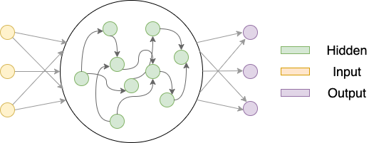

# NeuroNN
Neural network has been increasingly used as a means to study both computational and theoretical neuroscience in recent years. We include some of the most commonly used the NN architectures in the research of neuroscience to ease the implementation process.

## Table of contents
[CTRNN (Continuous-Time RNN)](#CTRNN)

## Frameworks
### CTRNN
We implemented the standard continuour-time RNN (CTRNN). This implementation also supports adding Excitator-Inhibitory contraints proposed in [Training Excitatory-Inhibitory Recurrent Neural Networks for Cognitive Tasks: A Simple and Flexible Framework](https://doi.org/10.1371/journal.pcbi.1004792) by Song et al. 2016.

For more detailed documentations, check out [here](./models/CTRNN/README.md).

## Structures
The detailed structure of any standard 3-layer RNN (as shown below) can be specified using masks. We provided easy implementations of a few RNN structures, that will generate HiddenLayer masks and its corresponding InputLayer/OutputLayer masks based on a few parameters.

### Single/Multi-Area RNN w/o EI Constraints
The HiddenLayer of a RNN could be a whole module or could be splitted into few modules. The implementation of both Single-Area RNN and Multi-Area RNN can be easily achieved using the [MultiArea class](./structures/README.md/#multiarea). An Multi-Area RNN that supports E/I constraints is also included in [MultiAreaEI class](./structures/README.md/#multiareaei).

[Examples](./examples/MultiArea.ipynb)

## Others
For similar projects: 
- [nn-brain](https://github.com/gyyang/nn-brain)
