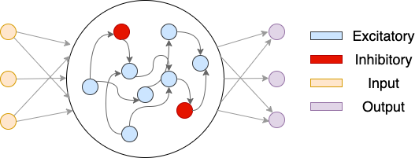

# Continuous-Time RNN
## Table of Contents
- [Introduction](#introduction)
- [Excitatory-Inhibitory Contrainted Continuous-Time RNN](#excitatory-inhibitory-contrainted-continuous-time-rnn)
- [Model Structure](#model-structure)
- [Parameters](#parameters)
    - [Structure and I/O dimensions](#structure-and-io-dimensions)
    - [Training parameters](#training-parameters)
    - [Constraints](#constraints)
- [Constraints And Masks](#constraints-and-masks)
    - [Dale's Law](#dales-law)
    - [New Synapse](#new-synapse)
    - [Self Connections](#self-connections)
- [Methods](#methods)

## Introduction
This is an implementation of the standard Continuous-Time RNN. CTRNN is in the standard 3-layer RNN structure as depicted below:

<p align="center"></p>


## Excitatory-Inhibitory Contrainted Continuous-Time RNN
The implementation of CTRNN also supports Excitatory-Inhibitory Contrainted Continuous-Time RNN (EIRNN). EIRNN is proposed by H. Francis Song, Guangyu R. Yang, and Xiao-Jing Wang in [Training Excitatory-Inhibitory Recurrent Neural Networks for Cognitive Tasks: A Simple and Flexible Framework](https://doi.org/10.1371/journal.pcbi.1004792)

The original [code](https://github.com/frsong/pycog) is implemented in [Theano](https://pypi.org/project/Theano/) and may be deprecated due to the unsupported Python version. Theano is no longer maintained after Jul 2020. In this repo, the PyTorch version of EIRNN is implemented. It is implicitly included in the CTRNN class and can be enabled by setting `use_dale` to `True` and use appropriate masks.

A visual illustration of the EIRNN is shown below.

<p align="center"></p>


The yellow nodes denotes nodes in the input layer. The middle circle denotes the hidden layer. There are blue nodes and red nodes, representing inhibitory neurons and ecitatory neurons, respectively. The depicted network has E/I ratio of 4/1. The purple nodes are ReadoutLayer neurons. The network structure is as follows:

## Model Structure
```
├── CTRNN
│   ├── RecurrentLayer
│   │   ├── InputLayer (class LinearLayer)
│   │   ├── HiddenLayer
│   ├── Readout_areas (class LinearLayer)
```
At the begining of each trial, the hidden states are set to zero. The recurrent layer, which contains the InputLayer and the HiddenLayer, is updated T/dt times during each trial. Finally, T/dt of hidden states are mapped out by the ReadoutLayer.<br>
For more details, refer to [Song et al. 2016](https://doi.org/10.1371/journal.pcbi.1004792).

## Parameters
### Structure and I/O dimensions
These parameters primarily determine the structure of the network. It is recommended to check these parameters before initializing the network.
| Parameter                | Default       | Type                                | Description                                |	
|:-------------------------|:-------------:|:-----------------------------------:|:-------------------------------------------|
| input_dim                | 1             | `int`                               | Input dimension                            |
| output_dim               | 1             | `int`                               | Output dimension                           |
| hidden_size              | 100           | `int`                               | Number of hidden nodes                     |
| spec_rad                 | 0.95          | `float`                             | HiddenLayer spectral radius                |
| self_connections         | False         | `boolean`                           | Whether a neuron can connect to itself     |
| activation               | 'relu'        | 'relu'/'tanh'/'sigmoid'/'retanh'    | Activation function                        |
| layer_distributions      | ['uniform', 'normal', 'uniform']      | `string`/`list`            | Layer distributions. Either `string` or a `list` of three elements. The `string` or `list` element must be either 'uniform' or 'normal'. If the given value is a `string`, it will set all three layers to the given distribution. If the provided value is a `list` of three elements, from the first to the last, correspond to the distribution of the InputLayer, HiddenLayer, and ReadoutLayer, respectively.       |
| layer_biases             | [False, False, False] | `boolean` or `list`  | Whether to use bias in each layer. Either a `boolean` or a `list` of three `boolean`s. If the given value is a list, from the first element to the last element, correspond to the InputLayer, HiddenLayer, and ReadoutLayer, respectively. |


### Training parameters
These parameters primarily determine the training process of the network. The `tau` and `dt` parameters are used to discretize the continuous-time dynamics. It is **highly recommended** to check these parameters before training. They have a significant impact on the training result.
| Parameter                | Default       | Type                                | Description                                |	
|:-------------------------|:-------------:|:-----------------------------------:|:-------------------------------------------|
| tau                      | 1             | `float`                             | Time constant                              |
| dt                       | 1             | `float`                             | Constant that used to discretize time      |
| recurrent_noise          | 0.05          | `float`                             | Whether to add zero-mean Gaussian recurrent noise during training. This is often employed to simulate the effect of biological perceptual noise. |
| keep_state               | False         | `boolean`                           | Whether to keep using the hidden state from previous trial |


### Constraints
These parameters primarily determine the constraints of the network. By default, the network is initialized using the most lenient constraints, i.e., no constraints being enforced.
| Parameter                | Default       | Type                       | Description                                |	
|:-------------------------|:-------------:|:--------------------------:|:-------------------------------------------|
| allow_negative           | True          | `boolean`/`list`      | Allow negative values or not in each layer.  If its a list, must have precisely three elements                   |
| use_dale                 | False         | `boolean`                  | Enfore Dale's law or not. Dale's law will only be enforced on the HiddenLayer and the ReadoutLayer                                                             |
| ei_balance               | 'neuron'      | 'neuron' or 'synapse'      | Balance excitatory/inhibitory connection strength on neuron e/i ratio or synapse e/i ratio                                                                   |
| new_synapses              | True         | `boolean`/`list`            | Whether a neuron can grow new connections. See [constraints and masks](#constraints-and-masks). If its a list, must have precisely three elements. Note: this must be checked even if your mask is sparse, otherwise new connection will still be generated                   |
| layer_masks              | `None` or `list` | `list` of `np.ndarray`               | Layer masks if `new_synapses/use_dale is set to true. From the first to last, the list elements correspond to the mask for Input-Hidden, Hidden-Hidden, and Hidden-Readout weights, respectively. Each mask must has the same dimension as the corresponding weight matrix. See [constraints and masks](#constraints-and-masks) for details.              |


## Constraints and masks
Constraints are enforced before each forward pass
### Dale's Law:
Masks (input, hidden, and output) cannot be `None` if `use_dale` is `True`.<br>
Only entries signs matter for the enforcement of Dale's law. All edges from the same neuron must be all excitatory or inhibitory. This is enforced across training using the `relu()` and `-relu()` functions.<br>
When `use_dale` is set to true, it will automatically balance the excitatory/inhibitory based on number of e/i neurons. To balance excitatory/inhibitory based on excitatory/inhibitory connection numbers, set `ei_balance` to 'synapse'.
### New Synapse:
`new_synapses` defines whether a neuron can 'grow' new connections.<br>
If plasiticity is set to False, neurons cannot 'grow' new connections. A mask must be provided if `new_synapses` is set to False.<br>
Only zeros entries matter. All entries that correspond to a zero value in the mask will remain zero across all time.
### Self Connections:
Whether a neuron can connect to itself. This is enforced along with the `new_synapses` mask. If mask is not specified but `self_connections` is set, a mask that only has zero entires on the diagonal will be generated automatically.

## Methods
| Method                   | Parameters                  | Description                                |
|:-------------------------|:---------------------------:|:-------------------------------------------|
| `save()`                 | `path`                      | Save the network to a given path           |
| `load()`                 | `path`                      | Load the network from a given path         |
| `print_layers()`         | None                        | Print the network architecture and layer-by-layer specifications |
| `train()`                | None                        | Set the network to training mode, training will be performed and constraints will be enforced |
| `eval()`                 | None                        | Set the network to evaluation mode, no training will be performed and no constraints will be enforced |

## Todos
- [ ] Load in connectivity matrices
- [ ] Test different activation functions
- [x] Bias when using dale's law?
- [ ] If the masks are not set, there need default values.
- [x] Potentially user can choose to enfore `new_synapses` or not for a specific layer
- [x] Re-write Dale's law such that it can still work when `new_synapses` is not enforced.
- [x] Can InputLayer and ReadoutLayer weights be negative when Dale's law enforced? checked.
- [x] Check if bias is not change when use_bias = False
- [x] Merge hidden_bias, input_bias, readout_bias to a single parameter
- [x] Merge hidden_dist, input_dist, readout_dist to a single parameter
- [ ] Check different exc_pct
- [ ] Consider to design 'allow_negative' better so that it won't be so verbotic
- [ ] When layer masks is not full
- [ ] Optimize constraints parameters