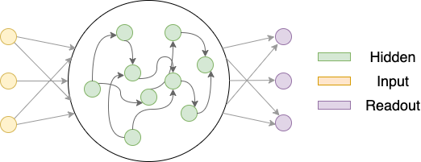

.. NN4Neurosci documentation master file, created by
   sphinx-quickstart on Mon Jan  8 14:17:55 2024.

NN4N: neural networks for computational neuroscience research
=============================================================

.. image:: https://img.shields.io/badge/License-MIT-yellow.svg
   :target: https://opensource.org/licenses/MIT
   :alt: License: MIT

.. image:: https://badge.fury.io/py/nn4n.svg
   :target: https://badge.fury.io/py/nn4n
   :alt: PyPI version

.. image:: https://static.pepy.tech/badge/nn4n
   :target: https://pepy.tech/project/nn4n
   :alt: Downloads

.. image:: https://static.pepy.tech/badge/nn4n/month
   :target: https://pepy.tech/project/nn4n
   :alt: Downloads per month

About
^^^^^

NN4Neurosci(nn4n) is a Python package that provides PyTorch-based neural network implementations
for modeling brains. It is designed to be easy to use and flexible for neuroscience research.

Acknowledgements
^^^^^^^^^^^^^^^^

Immense thanks to `Dr. Christopher J. Cueva <https://www.metaconscious.org/author/chris-cueva/>`_ 
for his mentorship in developing this project. This project can't be done without his invaluable help.

Contents
^^^^^^^^

.. toctree::
   :maxdepth: 4

   Get Started <get_started>
   User Guides <user_guides>

Indices and tables
^^^^^^^^^^^^^^^^^^

* :ref:`genindex`
* :ref:`modindex`
* :ref:`search`
