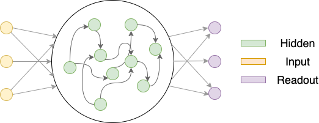
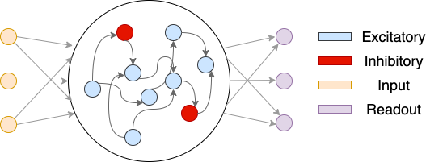
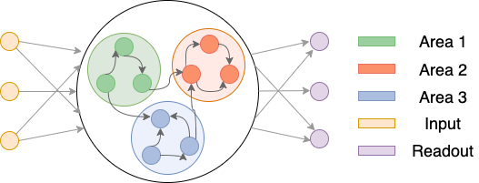

.. toctree::
   :glob:
   :hidden:

   nn4n.nn
   nn4n.utils
   nn4n.mask
   nn4n.criterion

NN4N: Neural Networks for Neurosimulations
==========================================

.. image:: https://img.shields.io/badge/License-MIT-yellow.svg
   :target: https://opensource.org/licenses/MIT
   :alt: License

.. image:: https://badge.fury.io/py/nn4n.svg
   :target: https://badge.fury.io/py/nn4n
   :alt: PyPI version

.. image:: https://static.pepy.tech/badge/nn4n
   :target: https://pepy.tech/project/nn4n
   :alt: Downloads

.. image:: https://static.pepy.tech/badge/nn4n/month
   :target: https://pepy.tech/project/nn4n
   :alt: Monthly Downloads

.. raw:: html
   
   

       <video autoplay loop muted playsinline width="500">
           <source src="./_static/attractor.mp4" type="video/mp4">
           Your browser does not support the video tag.
       </video>
   

Documentation
-------------
- `Installation <https://nn4n.org/install/installation/>`_
- `Quickstart <https://nn4n.org/install/quickstart/>`_

About
-----
RNNs are a powerful tool for modeling the dynamics of neural systems. They’ve been applied to a range of cognitive tasks, including working memory, decision-making, and motor control. Despite their strengths, standard RNNs have limitations when it comes to modeling the brain. They often lack biological realism, such as the inclusion of excitatory and inhibitory neurons. Their layer-wise design tends to focus on feedforward connections, leaving out the (potentially important) feedback connections that real neural systems have. On top of that, neurons within each layer are typically homogeneous, which doesn’t reflect the diversity seen in actual brain networks.

This project aims to address these issues by improving the biological plausibility of RNN models. It moves away from layer-based structures and adds controls over connectivity and neuron properties, making the models more flexible and representative of real neural dynamics. It’s also designed to be practical for computational neuroscience, allowing for concise definitions of complex recurrent structures and easy access to hidden layer activity. The goal is to create a tool that is both biologically realistic and straightforward to use for exploring neural systems.

Network Structures
------------------

**Vanilla Continuous Time RNN**

A simplistic Vanilla Continuous Time RNN contains three layers: an input layer, a hidden layer, and a readout layer, as depicted below.

The yellow nodes represent neurons that project input signals to the hidden layer, the green neurons are in the hidden layer, and the purple nodes represent neurons that read out from the hidden layer neurons. Both input and readout neurons are 'imagined' to be there. I.e., they only project or receive signals and, therefore, do not have activations and internal states.

**Excitatory-Inhibitory Constrained Continuous Time RNN**

The implementation of Continuous Time RNN also supports Excitatory-Inhibitory constrained continuous-time RNN (EIRNN) similar to what was proposed by H. Francis Song, Guangyu R. Yang, and Xiao-Jing Wang in `Training Excitatory-Inhibitory Recurrent Neural Networks for Cognitive Tasks: A Simple and Flexible Framework <https://doi.org/10.1371/journal.pcbi.1004792>`_.

A visual illustration of the EIRNN is shown below.

The yellow nodes denote nodes in the input layer. The middle circle denotes the hidden layer. There are blue nodes and red nodes, representing inhibitory neurons and excitatory neurons, respectively. The depicted network has an E/I ratio of 4/1. The purple nodes are ReadoutLayer neurons.

**Multi-Area Continuous Time RNN**

The RNN could also contain multiple areas. Denote the neurons in the hidden layer as :math:`\mathcal{N} = \{ n_1, n_2, \ldots, n_{N_{hid}} \}`. The neurons within it may be partitioned into multiple areas, :math:`\mathcal{A} = \{A_1, A_2, \ldots, A_{N_{area}}\}`. The areas are disjoint and their union is the set of all neurons in the hidden layer, i.e., :math:`\mathcal{N} = \bigcup_{i=1}^{N_{area}} A_i`. Neurons within the same area may be more densely connected and even receive different inputs.

A visual illustration of the Multi-Area Continuous Time RNN:

Papers Using NN4Neurosim
------------------------

**Time Makes Space: Emergence of Place Fields in Networks Encoding Temporally Continuous Sensory Experiences** in *NeurIPS 2024*  
`Project <https://zhaozewang.github.io/projects/time_makes_space/>`_ | `PDF <https://openreview.net/pdf?id=ioe66JeCMF>`_

.. code-block:: bibtex

    @inproceedings{
      wang2024time, 
      title={Time Makes Space: Emergence of Place Fields in Networks Encoding Temporally Continuous Sensory Experiences}, 
      author={Zhaoze Wang and Ronald W. Di. Tullio and Spencer Rooke and Vijay Balasubramanian}, 
      booktitle={Proceedings of the 2024 Conference on Neural Information Processing Systems (NeurIPS)}, 
      year={2024}
    } 

Acknowledgement
---------------

I would like to thank `Dr. Christopher J. Cueva <https://www.metaconscious.org/author/chris-cueva/>`_ for his mentorship in the original implementation of this project.

License
-------

This project is licensed under the terms of the MIT license.
