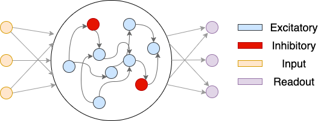

CTRNN()
=======

Continuous Time Recurrent Neural Network (CTRNN) model. 
CTRNN is in the standard 3-layer RNN structure as depicted below:

.. image:: ../../_static/basics/RNN_structure.png
    :align: center
    :alt: RNN structure
    :width: 400px

Contents:
---------
.. contents::
   :local:
   :depth: 3

Class Methods
^^^^^^^^^^^^^

.. autoclass:: nn4n.model.CTRNN
   :members:

Keyword Arguments
^^^^^^^^^^^^^^^^^

Structure Arguments
"""""""""""""""""""

`'dims'`
    description: 
        Dimensions of the network. Must be a list of three integers. 
        The first element is the input dimension, the second element is the hidden 
        layer size, and the third element is the output dimension.

    default: [1, 100, 1]
    
    type: ``list`` of ``int``

`'activation'`
    description: Activation function for the hidden layer neurons.

    default: 'relu'

    type: ``str``

    values: 'relu', 'sigmoid', 'tanh', 'linear'

`'weights'`
    description: 
        Initial weights for the network. Either a distribution or a matrix should be provided.
        If a distribution is provided, the weights will be sampled from the distribution. If a single ``str`` is
        provided as the distribution, it will be broadcasted to the initializations of all weights. If a list of
        ``str`` is provided, each element will be used to initialize the corresponding weight matrix. If a matrix
        If a matrix is provided, it must be a list of three matrices with the correct dimensions.

    default: 'uniform'

    type: ``str`` or ``list`` of ``str`` or ``list`` of ``np.ndarray``

    values: 'uniform', 'normal'

`'biases'`
    description: 
        Initial biases for the network. Either a distribution or a vector should be provided.
        If a distribution is provided, the biases will be sampled from the distribution. If a single ``str`` or ``None`` is
        provided as the distribution, it will be broadcasted to the initializations of all biases. If a list of
        ``str`` is provided, each element will be used to initialize the corresponding bias vector.
        If a vector is provided, it must be a list of three vectors with the correct dimensions.

    default: 'uniform'

    type: ``str`` or ``list`` of ``str`` or ``list`` of ``np.ndarray``

    values: 'uniform', 'normal', 'zeros'

Training Arguments
""""""""""""""""""

`'dt'`
    description: 
        Discrete time step for the network. Must be a positive number.

    default: 10 (ms)

    type: ``int``

`'tau'`
    description: 
        Time constant for the network. Must be a positive number.

    default: 100

    type: ``int``

`'preact_noise'`
    description: 
        Whether to add zero-mean Gaussian pre-activation noise during training. 
        The noise is added before the activation function is applied.

    default: 0

    type: ``float``

`'postact_noise'`
    description: 
        Whether to add zero-mean Gaussian post-activation noise during training. 
        The noise is added after the activation function is applied.
    
    default: 0

    type: ``float``

`'init_state'`
    description:
        Initial state for the network during each trial. must be one of 'zero', 'keep', or 'learn'.
        'zero' will set the hidden states to zero at the beginning of each trial. 
        'keep' will keep the hidden states at the end of the previous trial. 
        'learn' will learn the initial hidden states. **Note:** 'keep' hasn't been tested yet.

    default: 'zero'

    type: ``str``

    values: 'zero', 'keep', 'learn'

Constraint Arguments
""""""""""""""""""""

The design logistic of controlling network dynamics is to have separate independent constraints for the
layer weights. To control the network dynamics to the level of every single neuron and its synapses, 
the constraints are applied via mask matrices with the same size as the weight matrices.
Some commonly used masks are implemented in :doc:`nn4n.mask <../mask/mask>`.

`'plasticity_masks'`
    description: 
        The masks for the plasticity of the network. It defines how plastic each weight (synapse) 
        is and helps letting different area in RNN representing different brain regions to update at different speed.
        If it is a single ``None`` or a list of three ``None``s, all synapses will update at the same speed.
        If a ``list`` of three masks is provided, the first element corresponds to the InputLayer,
        the second element corresponds to the HiddenLayer, and the third element corresponds to the ReadoutLayer.
        The mask must match the shape of the corresponding weight matrix.
    
    default: ``None``

    type: a single ``None``, ``list`` of three ``None``, ``list`` of three ``np.ndarray`` or ``torch.Tensor``

`'ei_masks'`
    description:
        The masks for the positivity of the network. It defines whether a weight (synapse) can be 
        excitatory or inhibitory. If it is a single ``None`` or a list of three ``None``s, all synapses
        will be unconstrained. If a ``list`` of three masks is provided, the first element corresponds to the InputLayer,
        the second element corresponds to the HiddenLayer, and the third element corresponds to the ReadoutLayer.
        The mask must match the shape of the corresponding weight matrix.

    default: ``None``

    type: a single ``None``, ``list`` of three ``None``, ``list`` of three ``np.ndarray`` or ``torch.Tensor``

`'sparsity_masks'`
    description: 
        The masks for the sparsity of the network. It defines whether a neuron can be connected to another neuron.
        If it is a single ``None`` or a list of three ``None``s, all synapses will be unconstrained. 
        If a ``list`` of three masks is provided, the first element corresponds to the InputLayer,
        the second element corresponds to the HiddenLayer, and the third element corresponds to the ReadoutLayer.
        The mask must match the shape of the corresponding weight matrix.

    default: ``None``

    type: a single ``None``, ``list`` of three ``None``, ``list`` of three ``np.ndarray`` or ``torch.Tensor``

Mathematical Formulation
^^^^^^^^^^^^^^^^^^^^^^^^

Background
""""""""""

The firing rate of a single neuron is described by the following equation:

.. math::
    fr_j^t = f(\alpha \sum_{i=0}^{N} w_{ij}fr_{i}^{t-1} + (1-\alpha) v^{t-1})

Where :math:`fr_j^t` is the firing rate of neuron :math:`j` at time :math:`t`, 
and :math:`f` is the activation function. :math:`\alpha` is the decay constant. 
:math:`w_{ij}` is the weight from neuron :math:`i` to neuron :math:`j`. 
:math:`v^{t-1}` is the action potential of neuron :math:`j` at time :math:`t-1`. 
:math:`N` is the number of neurons connected to neuron :math:`j`.

The above equation can be generalized to the whole network as follows:

.. math::
    \vec{fr^t} = f(\alpha W^T \vec{fr^{t-1}} + (1-\alpha) v_j^{t-1})

Describing RNN dynamics
"""""""""""""""""""""""

Following similar vein as the above, the dynamics of the RNN can be described as:

.. math::
    \tau \frac{d v^t}{dt} = -v^t + W_{hid}^T f(v^t) + W_{in}^T u^t + b_{hid} + \epsilon_t

Where :math:`\tau` is the time constant, :math:`v^t` is the action potential of the hidden 
layer neurons at time :math:`t`, :math:`W_{hid}` is the weight matrix for the hidden layer
neurons, :math:`f` is the activation function, :math:`W_{in}` is the weight matrix for the
input layer neurons, :math:`u^t` is the input at time :math:`t`, :math:`b_{hid}` is the bias, 
and :math:`\epsilon_t` is the noise at time :math:`t`.

Convert to discrete time:

.. math::
    d v^t = \frac{dt}{\tau} (-v^t + W_{hid}^T f(v^t) + W_{in}^T u^t + b_{hid} + \epsilon_{t, preact})

Let :math:`\alpha = \frac{dt}{\tau}` and add :math:`\epsilon_{t, preact}` and :math:`\epsilon_{t, postact}` 
to represent noise before and after activation function respectively. Then the update rule becomes:

.. math::
    v^{t+1} = v^t + d v^t = v^t + \alpha (-v^t + W_{hid}^T f(v^t) + W_{in}^T u^t + b_{hid} + \epsilon_{t, preact})

.. math::
    v^{t+1} = (1-\alpha) v^t + \alpha( W_{hid}^T f(v^t) + W_{in}^T u^t + b_{hid} + \epsilon_{t, preact})

.. math::
    fr^{t+1} = f((1-\alpha) v^t + \alpha( W_{hid}^T f(v^t) + W_{in}^T u^t + b_{hid} + \epsilon_{t, preact})) + \epsilon_{t, postact}

Implementing other RNN derivatives with CTRNN
^^^^^^^^^^^^^^^^^^^^^^^^^^^^^^^^^^^^^^^^^^^^^

Excitatory-Inhibitory Constrained Continuous-Time RNN
"""""""""""""""""""""""""""""""""""""""""""""""""""""

Excitatory-Inhibitory constrained continuous-time RNN (EIRNN) is a powerful framework to account for the
excitatory and inhibitory nature of neurons. According to Dale's law, a neuron can only be either excitatory
or inhibitory. This constraint is implemented by using a mask matrix to separate the excitatory and inhibitory
neurons. If the ``ei_mask`` is set, the CTRNN class clip synapses that violate the constraint, similar to the
method discussed in `Training Excitatory-Inhibitory Recurrent Neural Networks for Cognitive Tasks: A Simple and Flexible Framework <https://doi.org/10.1371/journal.pcbi.1004792>`_.

A visual illustration of the EIRNN is shown below.

The yellow nodes denote nodes in the input layer. The middle circle denotes the hidden layer. 
There are blue nodes and red nodes, representing inhibitory neurons and excitatory neurons, 
respectively. The depicted network has an E/I ratio of 4/1. The purple nodes are ReadoutLayer neurons. 
