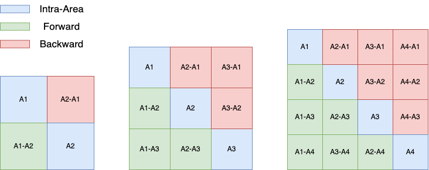
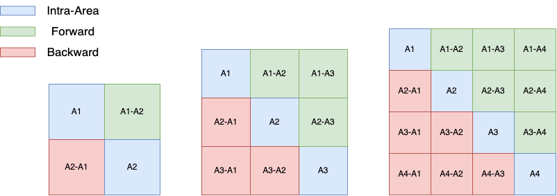
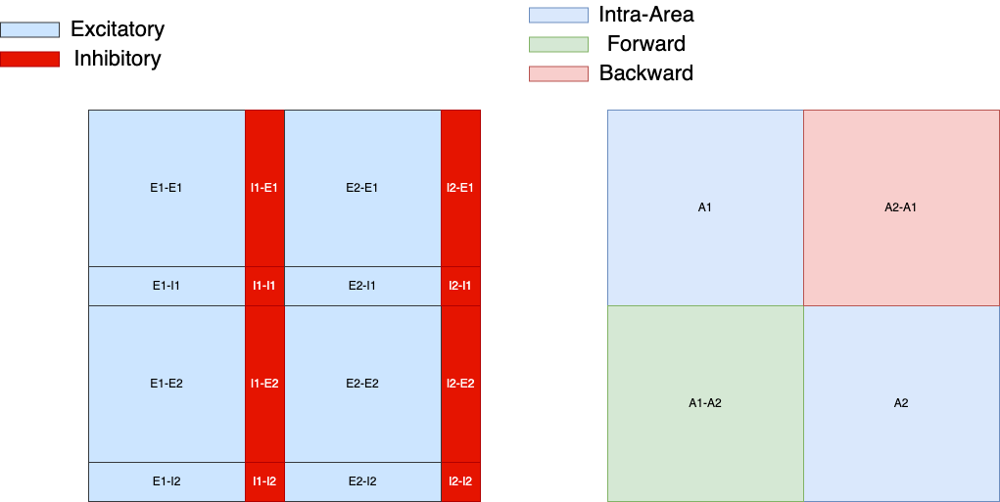

# RNN structures
## Introduction
This module defines structures for any RNN in the standard 3-layer architectures (as shown below). The structures of the hidden layer in this project are defined using masks. Therefore, classes in this module will generate input_mask, hidden_mask, and output_mask that are used in other  

Where yellow nodes are in the input layer, green nodes are in the hidden layer, and purple nodes are in the output layer.

## Table of contents
- [Multi Area](#multiarea)
- [Multi Area EI](#multiareaei)

## Structures
### MultiArea
#### [Examples](../examples/MultiArea.ipynb)
This will generate a multi-area RNN without E/I constraints. Therefore, by default, the input/hidden/output masks are binary masks. Use cautious when the `use_dale` parameter of CTRNN is set to True, because it will make all neurons to be excitatory.
**NOTE:** This also implicitly covers single area case. If `n_area` is set to 1. All other parameters that conflict this setting will be ignored.
| Parameter                | Default       | Type                       | Description                                |	
|:-------------------------|:-------------:|:--------------------------:|:-------------------------------------------|
| n_areas                  | 2             | `int` or `list`            | Number of areas. - If `n_areas` is an integer, `n_areas` must be a divisor of `hidden_size`. It will divide the HiddenLayer into three equal size regions. - If `n_areas` is a list, it must sums up to `hidden_size`, where each element in the list denote the number of neurons in that area.   |
| area_connectivities      | [0.1, 0.1]    | `list` or `np.ndarray`   | Area-to-area connection connectivity. Entries must between `[0,1]` - When `area_connectivities` is a list, all forward/backward connections will have the same sparsity. - If its a list of two elements, the first element is the forward connectivity, and the second is the backward connectivity. The within-area connectivity will be 1. - If its a list of three elements, the last element will be the within-area connectivity. - If `area_connectivities` is an `np.ndarray`, it must be of shape (`n_areas`, `n_areas`). See [forward/backward specifications](#forward-backward-specifications)|
| input_areas              | `None`        | `list` or `None`          | Areas that receive input. None if input to all areas. InputLayer is either densely connect to an area or doesn't connect to it at all.    |
| output_areas             | `None`        | `list` or `None`          | Areas that readout from. None if readout from all areas. OutputLayer is either densely connect to an area or doesn't connect to it at all.    |
| input_size               | 1             | `int`                      | Input dimension. It is used to compute the size of input layer, must be set. |
| hidden_size              | None          | `int`                      | HiddenLayer size. Must be set.              |
| output_size              | 1             | `int`                      | Output dimension. It is used to compute the size of input layer, must be set. |

| Attributes               | Type                       | Description                                |	
|:-------------------------|:--------------------------:|:-------------------------------------------|
| n_areas                  | `int`                      | Number of areas                            |
| node_assigment           | `list`                     | Nodes area assignment                      |
| input_size               | `int`                      | Input dimension                            |
| hidden_size              | `int`                      | Number of nodes in the HiddenLayer         |
| output_size              | `int`                      | Output dimension                           |
| area_connectivities      | `np.ndarray`               | Area-to-area connectivity matrix. If it is a list in params, it will be transformed into a numpy matrix after initialization                   |

#### Forward Backward Specifications
RNNs can be implemented in various ways, in this library,
$$s W^T + b$$
is used in the HiddenLayer forward pass, where $W$ is the connectivity matrix of the HiddenLayer and $s$ is the current HiddenLayer state. 
$W$ may not matter if your connectivity matrix is symetric. But if it's not, you might want to pay attention to the forward connections and backward connections. In the figure below, three networks (`n_areas` = 2, 3, 4) and their corresponding forward/backward connection matrix are provided. The blue regions are intra-area connectivity, the green regions are forward connections, and the red regions are backward connections.

<!--  -->

### MultiAreaEI
#### [Examples](../examples/MultiArea.ipynb)
| Parameter                     | Default                 | Type                       | Description                                |
|:------------------------------|:-----------------------:|:--------------------------:|:-------------------------------------------|
| ext_pct                       | 0.8                     | `float`                    | Percentage of excitatory neurons           |
| inter_area_connections        |[True, True, True, True] | `list` (of booleans)       | Allows for what type of inter-area connections. `inter_area_connections` must be a `boolean` list of 4 elements, denoting whether 'exc-exc', 'exc-inh', 'inh-exc', and 'inh-inh' connections are allowed between areas. see [inter-area connections under EI constraints](#inter-area-connections-under-ei-constraints). |
| inh_output                    | True                     | `boolean`                 | Whether to have inhibitory output neurons    |

#### Inter-Area Connections Under EI Constraints
Depending on the specific problem you are investigating on, it is possible that you want to eliminate inhibitory connections between areas. Or, you might not want excitatory neurons to connect to inhibitory neurons in other areas. See figure below for different cases of inter-area connections under EI constraints.

To specify what kinds of inter-area connections you want to keep, simple pass a 4-element boolean list to `inter_area_connections`. The 4 elements denotes whether to keep inter-area 'exc-exc', 'exc-inh', 'inh-exc', and 'inh-inh' connections.